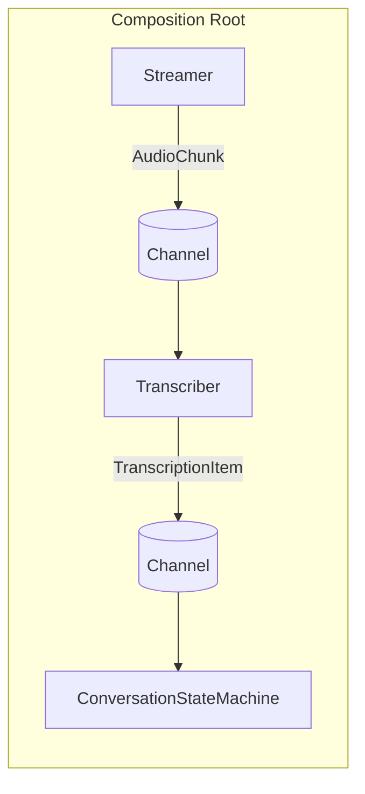

## Unit tests: Sample runs and model handling

- Tests live in `ErnestAi.Sandbox.Chunking.UnitTests/` and discover scenarios in `SampleRuns/<scenario>/` that contain `audio.wav` and `expected.json`.
- Tests ensure the Whisper model is present in the same cross-platform cache directory (`Tools/AppPaths.cs`). If missing, they:
  - Attempt to copy the model from `ErnestAi.Sandbox.Chunking/Models/Whisper/` in the repo.
  - If still missing and the scenario provides a `modelUrl` in `expected.json`, download it there.
- Each test constructs `SpeechToTextService` with the local model path.

# ErnestAi.Sandbox.Chunking

A minimal, isolated console sandbox to prototype a chunked audio pipeline:
- Record short audio chunks from the microphone
- Transcribe each chunk to text
- Drive a conversation state machine based on wake word and silence windows
- Aggregate a session transcript when the conversation ends

This project is the embryo for a modular, queue-driven architecture and the place where we will now wire the full local assistant loop: STT → LLM → TTS. The immediate goal is to keep everything runnable inside this sandbox and then consolidate the repository around it.

## Pipeline overview

- Streamer reads microphone input, segments with simple VAD, and emits `AudioChunk` items.
- Transcriber consumes `AudioChunk`, performs STT, and emits `TranscriptionItem` items.
- ConversationStateMachine (CSM) consumes `TranscriptionItem` items, manages session state (quiescent/listening/processing), and prints the aggregated session prompt on end-of-session.
  
### Mermaid diagram (as implemented in code)

## Key components and files

- Streamer: `Pipeline/Streamer.cs`
  - Continuously captures mic audio, performs simple VAD segmentation, and emits `AudioChunk` to a bounded channel.
  - Supports pre/post padding and optional full-session WAV recording.

- Transcriber: `Pipeline/Transcriber.cs`
  - Consumes `AudioChunk`, calls `ISpeechToTextService.TranscribeAsync(stream)`.
  - Emits `TranscriptionItem` with sequence, timestamp, text, meaningful flag, and word count.
  - Console UX: prints meaningful text lines; prints compact dots during silence.

- ConversationStateMachine: `Pipeline/ConversationStateMachine.cs`
  - Consumes `TranscriptionItem` from the channel (via a reader loop started in `Program.cs`).
  - Transitions: Quiescent → Listening (wake word), Listening ↔ Processing (silence threshold), Listening → Quiescent (extended silence).
  - A lightweight background ticker in `Program.cs` periodically calls `ConversationStateMachine.Tick(...)` so silence windows advance even when no new items arrive.
  - Buffers meaningful items during a session; on end-of-session prints an aggregated prompt.

- Contracts: `Core/Interfaces/*.cs`
  - `IAudioProcessor`, `ISpeechToTextService` keep the sandbox decoupled from implementations.

- Implementations: `Audio/AudioProcessor.cs`, `Speech/SpeechToTextService.cs`
  - Minimal, single-responsibility classes used by the sandbox.

- Utilities: `Tools/FileSystem.cs`, `Tools/FileDownloader.cs`, `Tools/AppPaths.cs`
  - Simple static helpers used at the composition root (see Philosophy below).
  - `AppPaths` provides cross-platform cache directories for models.

## Execution flow (high level)

1) `Program.cs` wires the pipeline:
   - Creates `Channel<AudioChunk>` and `Channel<TranscriptionItem>`.
   - Prepares Whisper STT model on disk in a cross-platform cache (downloads once if missing).
   - Registers concrete services, then starts three tasks:
     - `Streamer.RunAsync()` produces audio chunks (segmented).
     - `Transcriber.RunAsync()` transcribes chunks and produces transcription items.
     - CSM consumer loop reads `TranscriptionItem` and drives state + aggregation.
     - A background ticker advances CSM silence windows.

2) On wake word detection, CSM enters Listening.

3) After short silence, CSM enters Processing; after extended silence, session ends.

4) CSM aggregates buffered `TranscriptionItem.Text` and prints the session prompt.

## Tunables (in `Program.cs`)

- `ChunkMs`: size of each recorded audio chunk (default: 3000 ms)
- `AudioQueueCapacity`: bounded channel capacity for `AudioChunk`
- `WakeWord`: simple case-insensitive match (default: "anna")
- `ProcessingSilenceSeconds`: short silence before marking as processing
- `EndSilenceSeconds`: extended silence to end the session

## Utilities and composition-root philosophy

- Balanced DI: We use dependency injection where it adds value, but keep simple, static utilities at the composition root for housekeeping (filesystem checks, downloads). Avoid heavy factory patterns for basic utilities.
- Async + Sync variants: In the sandbox host/composition root, utility functions provide both asynchronous and synchronous versions. Order methods with Async first, then the synchronous wrapper immediately after.
  - `Tools/FileDownloader.cs`:
    - Async: `EnsureFileAsync`, `EnsureInDirectoryAsync`, `DownloadToFileAsync`
    - Sync:  `EnsureFile`, `EnsureInDirectory`, `DownloadToFile`
  - `Tools/AppPaths.cs`:
    - Async: `GetCacheRootAsync()`, `GetModelCacheDirAsync()`
    - Sync:  `GetCacheRoot()`, `GetModelCacheDir()`
  - `Tools/FileSystem.cs` is intentionally simple and synchronous for path operations.

## AI models working on the project (philosophies)

This sandbox prototypes the ingestion side. The broader ErnestAI project follows these principles when integrating AI models:

- Keep it local-first and self-contained when possible.
- Favor simplicity and clear responsibilities; avoid leaking IO/network concerns into core services.
- Strict, explicit configuration (no hidden defaults) and early validation at startup.
- Minimal warmup strategy for local models: small, periodic pings controlled by config; minimal logging.
- Output filtering (e.g., regex) applied at model service boundaries to normalize provider-specific artifacts.
- Deterministic selection of providers/models based on ordered preference in config; fail fast if unavailable.

Sandbox specifics related to STT:
- Uses Whisper (CPU) with a small English model (e.g., `ggml-base.en.bin`).
- Model path is prepared in `Program.cs` using `Tools.FileDownloader` and passed into `SpeechToTextService` (the service does not download).
- The model is stored in an OS-standard cache location from `Tools/AppPaths.cs`:
  - Windows: `%LocalAppData%/ErnestAi/Cache/Models/Whisper`
  - macOS: `~/Library/Caches/ErnestAi/Models/Whisper`
  - Linux: `$XDG_CACHE_HOME/ErnestAi/Models/Whisper` or `~/.cache/ErnestAi/Models/Whisper`

LLM + TTS integration (in this sandbox):
- Aggregate the session text into a prompt and send it to a local language model (Ollama), then synthesize the response with local TTS.

### Immediate plan to reach full STT → LLM → TTS

- __Event from CSM__: Raise a session-end event when aggregation completes.
  - File: `Pipeline/ConversationStateMachine.cs`
  - Add: `public event Action<string>? SessionEnded;` (or async `Func<string, Task>?`), fire it in `TransitionToQuiescent(...)` with the aggregated prompt.

- __Wire LLM & TTS in Program__: Subscribe to the event and invoke LLM, then TTS.
  - File: `Program.cs`
  - Register `ILanguageModelService` → `ErnestAi.Intelligence.OllamaLanguageModelService` (base URL e.g., `http://localhost:11434`, set `CurrentModel`, optional `SystemPrompt`).
  - Register `ITextToSpeechService` → `ErnestAi.Speech.TextToSpeechService` and call `InitializeOnce(voice, rate, pitch)`.
  - On `SessionEnded(prompt)`: `var reply = await llm.GetResponseAsync(prompt); await tts.SpeakToDefaultOutputAsync(reply);`

- __Keep composition-root simplicity__:
  - Perform any model availability checks and simple configuration in `Program.cs`.
  - Avoid pushing download/network concerns into service classes.

### Prerequisites for LLM/TTS

- __Ollama__: Install and run locally. Ensure a model is available (e.g., `llama3`, `qwen2.5`, `mistral`). The service file is `ErnestAi.Intelligence/OllamaLanguageModelService.cs`.
- __Windows TTS__: Uses `System.Speech.Synthesis` via `ErnestAi.Speech/TextToSpeechService.cs`. Ensure at least one voice is installed. Configure voice/rate/pitch in `Program.cs`.

### Minimal tests to validate the loop

- Extend unit tests to cover the session-end flow:
  - Drive STT from a recorded sample (`UnitTests/SampleRuns/...`).
  - Mock or stub `ILanguageModelService` to return a deterministic response.
  - Assert TTS invocation (e.g., write to file with `SpeakToFileAsync`).

## Getting started

- Prerequisites: .NET 8 SDK, microphone access.
- First run will download the Whisper model to the cross-platform cache directory shown above.
- Build and run from your preferred environment. The user prefers to run builds manually.

Once running:
- Speak the wake word (default: "anna") to enter Listening.
- Speak naturally; short silences move into Processing; extended silence ends the session.
- The aggregated session text is printed as a prompt line, then routed to the LLM and spoken back via TTS once the integration above is wired.

## Consolidation plan (post-implementation)

- __Phase 1__: Complete the in-sandbox STT → LLM → TTS flow as described.
- __Phase 2__: Migrate any reusable interfaces/utilities needed by the sandbox; retire redundant projects that are superseded by this unified flow.
- __Phase 3__: Restructure the repository to focus on this core assistant, keeping tests and sample runs as quality gates.

## Extensibility ideas

- Replace wake word detection with a streaming detector.
- Support multiple STT engines behind `ISpeechToTextService`.
- Introduce a plug-in Aggregator to perform smarter chunk selection/cleaning.
- Wire the aggregated prompt into the LLM and TTS chains.

---

Status: experimental sandbox for pipeline prototyping. Contributions welcome.
